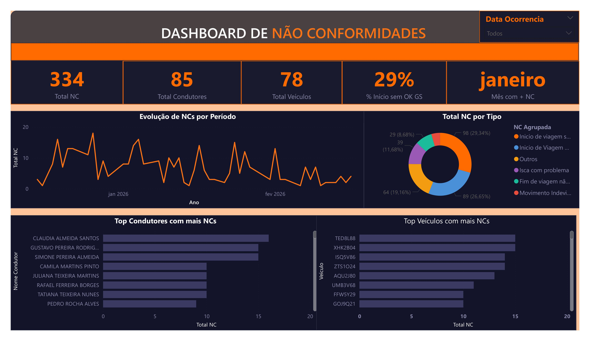

# 📊 Dashboard de Não Conformidade — Gerenciamento de Riscos

> Projeto de Business Intelligence desenvolvido no Power BI para monitoramento e análise de não conformidades dentro do contexto de Gerenciamento de Riscos.

---

## 🎯 Objetivo

Acompanhar e visualizar as não conformidades identificadas no processo de gerenciamento de riscos, permitindo uma visão clara dos indicadores e apoiando a tomada de decisão.

---

## 🛠️ Ferramenta Utilizada

- **Power BI Desktop**

---

## 📊 Visualizações do Dashboard

- 📌 **Cartões KPI** — indicadores principais de não conformidades
- 📊 **Gráficos de Barras** — comparativo por categoria/período
- 🍩 **Gráfico de Rosca** — distribuição percentual das ocorrências
- 📈 **Gráfico de Linhas** — evolução temporal das não conformidades

---

## 📁 Estrutura do Repositório

```
dashboard-nao-conformidades-powerbi/
├── Não_conformidade.pbix       # Arquivo principal do Power BI
├── dashboard.pdf               # Versão PDF para visualização rápida
├── README.md                   # Documentação do projeto
└── screenshots/
    └── projeto-nao-conformidade.jpg  # Preview do dashboard
```

---

## 👁️ Preview



---

## 📄 Visualizar o Dashboard

👉 [Clique aqui para ver o PDF do dashboard](./dashboard.pdf)

---

## ▶️ Como Usar

1. Faça o download do arquivo `Não_conformidade.pbix`
2. Abra no **Power BI Desktop** (gratuito em [powerbi.microsoft.com](https://powerbi.microsoft.com))
3. Atualize a fonte de dados conforme necessário

---

## 👨‍💻 Autor

Desenvolvido por **Felipe Valentim**
🔗 [LinkedIn](https://linkedin.com/in/seu-perfil) | [GitHub](https://github.com/infofvalentim)

---

## 📚 Nível do Projeto

🟢 **Iniciante** — Projeto de aprendizado e desenvolvimento de habilidades em Power BI e visualização de dados.

---

⭐ Se este projeto foi útil para você, deixe uma estrela no repositório!
